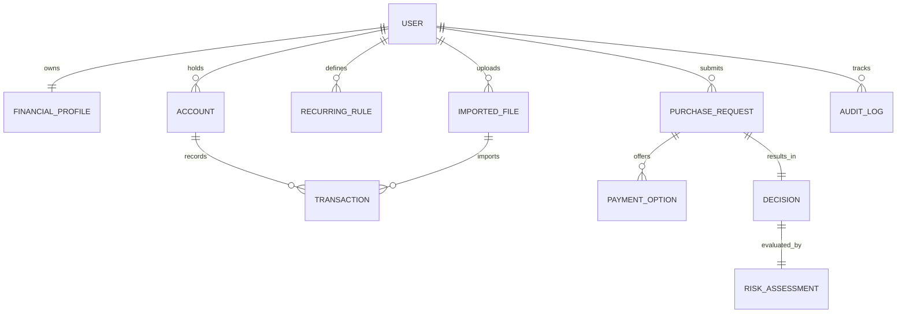

# Domain Model Specification: Buy or Wait?

**Document Version**: 1.0.0  
**Phase**: Phase 1 — Production Architecture & Discovery  
**Domain Layer**: Clean Architecture / Domain-Driven Design (DDD)

---

## 1. Domain Entities & Aggregate Roots

The domain model bridges the gap between database persistence, user-facing REST models, and the core calculation engine (`FinancialState`, `Ledger`, `Decision`).



---

## 2. Enumerations & Value Objects

### 2.1 Currency Code (Value Object)
- **Format**: ISO-4217 uppercase 3-letter string (`USD`, `EUR`, `INR`, `ZAR`, `IDR`, `GBP`, `CAD`, `AUD`, `SGD`, `JPY`).

### 2.2 Cash Flow & Transaction Enums
```python
class TransactionStatus(str, Enum):
    SETTLED = "settled"          # Cleared cash transaction
    PENDING = "pending"          # Authorized debit; cash held in reserve
    SCHEDULED = "scheduled"      # Known future scheduled event
    UNREALIZED = "unrealized"    # Non-cash valuation / pending investment
    CANCELLED = "cancelled"      # Explicitly cancelled event
    VOID = "void"                # Erroneous or reversed record

class CashType(str, Enum):
    IMMEDIATE_DEBIT = "immediate_debit"  # Settled or pending debit affecting current cash
    FUTURE_DEBIT = "future_debit"        # Future scheduled outgoing expense
    SETTLED_INCOME = "settled_income"    # Historical income (used for cadence/history)
    CONFIRMED_INCOME = "confirmed_income"# Verified scheduled payroll
    NON_CASH = "non_cash"                # Illiquid assets / paper valuation
    VOID = "void"                        # No cash impact

class Flexibility(str, Enum):
    FIXED = "fixed"                                  # Must be paid in full (rent, loan)
    REDUCIBLE = "reducible"                          # Can be reduced to minimum_allowed_amount
    STOPPABLE = "stoppable"                          # Can be completely paused (gym, streaming)
    REDUCIBLE_OR_STOPPABLE = "reducible_or_stoppable"# Either reduction or pause is valid

class Cadence(str, Enum):
    DAILY = "daily"
    WEEKLY = "weekly"
    BI_WEEKLY = "bi_weekly"
    MONTHLY = "monthly"
    QUARTERLY = "quarterly"
    ANNUAL = "annual"
    IRREGULAR = "irregular"
```

### 2.3 Decision & Solvency Enums
```python
class AffordabilityStatus(str, Enum):
    AFFORDABLE_NOW = "affordable_now"              # Safe to purchase today in full
    AFFORDABLE_WITH_PLAN = "affordable_with_plan"  # Safe via installments, partials, or cuts
    AFFORDABLE_LATER = "affordable_later"          # Safe in full on a projected future date
    NOT_AFFORDABLE = "not_affordable"              # Cannot be safely accommodated

class PaymentMethod(str, Enum):
    FULL_PAYMENT = "full_payment"
    PARTIAL_PAYMENT = "partial_payment"
    INSTALLMENTS = "installments"
    WAIT = "wait"
    NOT_RECOMMENDED = "not_recommended"

class RiskTier(str, Enum):
    LOW_RISK = "LOW_RISK"            # Safe even under P90 expenditure stress
    MODERATE_RISK = "MODERATE_RISK"  # Safe on baseline; sensitive to variable spending spikes
    HIGH_RISK = "HIGH_RISK"          # Solvency deficit under baseline cash flow

class IngestionStatus(str, Enum):
    PENDING = "pending"
    PARSING = "parsing"
    NEEDS_REVIEW = "needs_review"
    COMPLETED = "completed"
    FAILED = "failed"
```

---

## 3. Detailed Entity Definitions

### 3.1 `User` (Aggregate Root)
Represents an authenticated account.
- `id`: `UUID` (Primary Key)
- `email`: `String(255)` (Unique, Indexed)
- `password_hash`: `String(255)` (Argon2id)
- `full_name`: `String(255)` (Optional)
- `is_active`: `Boolean` (Default: True)
- `created_at`: `TimestampWithTimeZone`
- `updated_at`: `TimestampWithTimeZone`

### 3.2 `FinancialProfile`
User's financial configuration and solvency guardrails.
- `id`: `UUID` (Primary Key)
- `user_id`: `UUID` (Foreign Key -> User.id, Unique)
- `home_currency`: `CurrencyCode` (Default: "USD")
- `current_available_balance`: `Decimal(18, 4)` (Liquid checking/savings balance)
- `minimum_balance_to_keep`: `Decimal(18, 4)` (Mandatory emergency threshold)
- `protected_categories`: `List[String]` (e.g., `["rent", "debt_repayment", "healthcare"]`)
- `reducible_categories`: `List[String]` (e.g., `["groceries", "dining", "shopping"]`)
- `stoppable_categories`: `List[String]` (e.g., `["streaming", "gym", "entertainment"]`)
- `payment_methods_accepted`: `List[String]` (e.g., `["cash", "installments", "partial"]`)
- `max_installment_months`: `Integer` (Nullable; null if user rejects financing)
- `burn_mode`: `String(32)` (Default: "daily_burn")
- `income_mode`: `String(32)` (Default: "reliable_only")
- `updated_at`: `TimestampWithTimeZone`

### 3.3 `Account`
Individual bank accounts or cash repositories.
- `id`: `UUID` (Primary Key)
- `user_id`: `UUID` (Foreign Key -> User.id, Indexed)
- `institution_name`: `String(128)` (e.g., "Chase Checking", "HDFC Savings")
- `account_mask`: `String(4)` (Last 4 digits)
- `account_type`: `String(32)` (`checking`, `savings`, `credit_card`)
- `currency`: `CurrencyCode`
- `balance`: `Decimal(18, 4)`
- `last_reconciled_at`: `TimestampWithTimeZone`

### 3.4 `Transaction`
Granular financial ledger entries (historical, current, and scheduled).
- `id`: `UUID` (Primary Key)
- `user_id`: `UUID` (Foreign Key -> User.id, Indexed)
- `account_id`: `UUID` (Foreign Key -> Account.id, Nullable, Indexed)
- `imported_file_id`: `UUID` (Foreign Key -> ImportedFile.id, Nullable)
- `raw_description`: `Text` (As imported from statement)
- `clean_merchant`: `String(255)` (Normalized merchant name)
- `category`: `String(64)` (e.g., "groceries", "rent", "salary")
- `amount`: `Decimal(18, 4)` (Positive for credit/income, negative for debit/expense)
- `currency`: `CurrencyCode`
- `amount_home`: `Decimal(18, 4)` (Converted to user's home currency)
- `transaction_date`: `Date` (Clearing or scheduled settlement date, Indexed)
- `status`: `TransactionStatus` (`settled`, `pending`, `scheduled`, etc.)
- `cash_type`: `CashType` (`immediate_debit`, `future_debit`, `confirmed_income`, etc.)
- `flexibility`: `Flexibility` (Default: `fixed`)
- `minimum_allowed_amount`: `Decimal(18, 4)` (Nullable; lower limit for reducible items)
- `dedup_hash`: `String(64)` (SHA-256 of date + amount + raw_description, Indexed)
- `is_recurring`: `Boolean` (Default: False)
- `recurring_rule_id`: `UUID` (Foreign Key -> RecurringRule.id, Nullable)
- `created_at`: `TimestampWithTimeZone`

### 3.5 `RecurringRule`
Inferred or user-confirmed repeating cash-flow streams.
- `id`: `UUID` (Primary Key)
- `user_id`: `UUID` (Foreign Key -> User.id, Indexed)
- `category`: `String(64)`
- `direction`: `String(16)` (`debit` or `credit`)
- `cadence`: `Cadence` (`weekly`, `bi_weekly`, `monthly`, etc.)
- `average_amount`: `Decimal(18, 4)`
- `confidence_score`: `Decimal(5, 4)` (0.0000 to 1.0000)
- `day_of_month`: `Integer` (1–31, Nullable)
- `day_of_week`: `Integer` (0–6, Nullable)
- `is_verified_by_user`: `Boolean` (Default: False)
- `is_active`: `Boolean` (Default: True)
- `last_observed_date`: `Date`
- `next_projected_date`: `Date`

### 3.6 `ImportedFile`
Audit and status tracking for uploaded CSV/OFX statement files.
- `id`: `UUID` (Primary Key)
- `user_id`: `UUID` (Foreign Key -> User.id, Indexed)
- `filename`: `String(255)`
- `storage_path`: `String(512)` (S3 URI)
- `file_size_bytes`: `BigInteger`
- `mime_type`: `String(64)`
- `status`: `IngestionStatus`
- `total_rows_parsed`: `Integer` (Default: 0)
- `valid_rows_imported`: `Integer` (Default: 0)
- `duplicate_rows_skipped`: `Integer` (Default: 0)
- `error_log`: `JSONB` (Array of parse/validation errors)
- `created_at`: `TimestampWithTimeZone`

### 3.7 `PurchaseRequest` (Aggregate Root)
A proposed expenditure submitted for affordability evaluation.
- `id`: `UUID` (Primary Key)
- `user_id`: `UUID` (Foreign Key -> User.id, Indexed)
- `item_description`: `String(255)` (e.g., "Apple MacBook Pro 16")
- `merchant_name`: `String(255)` (e.g., "Apple Store")
- `category`: `String(64)` (e.g., "electronics")
- `requested_amount`: `Decimal(18, 4)` (> 0)
- `currency`: `CurrencyCode`
- `request_date`: `Date` (Evaluation base date)
- `desired_completion_date`: `Date` (Deadline for full settlement)
- `allows_partial_payment`: `Boolean` (Default: True)
- `created_at`: `TimestampWithTimeZone`

### 3.8 `PaymentOption`
Financing or installment options offered by the seller.
- `id`: `UUID` (Primary Key)
- `purchase_request_id`: `UUID` (Foreign Key -> PurchaseRequest.id, Indexed)
- `option_code`: `String(64)` (e.g., "3_month_zero_interest", "affirm_6mo")
- `total_payable`: `Decimal(18, 4)`
- `down_payment`: `Decimal(18, 4)` (Default: 0)
- `number_of_installments`: `Integer`
- `installment_amount`: `Decimal(18, 4)`
- `cadence`: `Cadence` (Default: "monthly")
- `first_payment_date`: `Date`
- `apr_percentage`: `Decimal(5, 2)` (Default: 0.00)

### 3.9 `Decision`
The evaluated recommendation emitted by the financial engine.
- `id`: `UUID` (Primary Key)
- `purchase_request_id`: `UUID` (Foreign Key -> PurchaseRequest.id, Unique)
- `user_id`: `UUID` (Foreign Key -> User.id, Indexed)
- `amount_safe_to_pay`: `Decimal(18, 4)` (0 <= amount <= requested_amount)
- `affordability_status`: `AffordabilityStatus`
- `recommended_payment_method`: `PaymentMethod`
- `payment_plan`: `Text` (Chronological formatted schedule or "none")
- `earliest_date_for_full_payment`: `Date` (Nullable)
- `spending_changes_needed`: `Text` (Max 3 actions formatted as `stop:id|reduce_to:id:amt` or "none")
- `decision_explanation`: `Text` (Auditable explanation)
- `raw_engine_payload`: `JSONB` (Complete Candidate & Diagnostic trace)
- `created_at`: `TimestampWithTimeZone`

### 3.10 `RiskAssessment`
The P90 uncertainty stress analysis associated with a Decision.
- `id`: `UUID` (Primary Key)
- `decision_id`: `UUID` (Foreign Key -> Decision.id, Unique)
- `risk_tier`: `RiskTier` (`LOW_RISK`, `MODERATE_RISK`, `HIGH_RISK`)
- `safe_amount_p50`: `Decimal(18, 4)`
- `safe_amount_p90`: `Decimal(18, 4)`
- `minimum_balance_p50`: `Decimal(18, 4)`
- `minimum_balance_p90`: `Decimal(18, 4)`
- `headroom_p50`: `Decimal(18, 4)`
- `headroom_p90`: `Decimal(18, 4)`
- `risk_reason`: `Text`
- `stress_summary`: `String(255)` (Top stressed categories e.g. "groceries:+24.0%|transport:+24.2%")
- `p90_breach_detected`: `Boolean`

### 3.11 `AuditLog`
Append-only tamper-evident event log.
- `id`: `BigSerial` (Primary Key)
- `user_id`: `UUID` (Foreign Key -> User.id, Indexed)
- `event_type`: `String(64)` (`balance_update`, `profile_change`, `statement_imported`, `purchase_evaluated`)
- `entity_type`: `String(64)`
- `entity_id`: `UUID`
- `actor_type`: `String(32)` (`user`, `system`, `admin`)
- `changes`: `JSONB` (`{before: {...}, after: {...}}`)
- `ip_address`: `String(45)`
- `created_at`: `TimestampWithTimeZone`

---

## 4. Domain Invariants & Validation Constraints

1. **Non-Negative Solvency Safe Amount**:
   $$\forall d \in \text{Decision}, \quad 0 \le d.\text{amount\_safe\_to\_pay} \le d.\text{requested\_amount}$$
2. **Strict Balance Floor Preservation**:
   $$\forall t \in [0, 90], \quad \text{ClosingBalance}(t) \ge \text{minimum\_balance\_to\_keep}$$
3. **Monotonicity Under Risk Stress**:
   $$\text{safe\_amount}_{P90} \le \text{safe\_amount}_{P50} + \epsilon \quad (\epsilon = 0.01)$$
4. **Plan Sum Conservation**:
   For any recommended `payment_plan` with installments or partial payments, the sum of all scheduled tranches must exactly equal the total payable amount:
   $$\sum_{p \in \text{tranches}} p.\text{amount} = \text{total\_payable}$$
5. **Legality of Spending Cuts**:
   - Only events where `category \in stoppable_categories` can be stopped.
   - Only events where `category \in reducible_categories` can be reduced.
   - `reduce_to` amount cannot be lower than the event's `minimum_allowed_amount`.
   - Maximum 3 spending change actions total.
