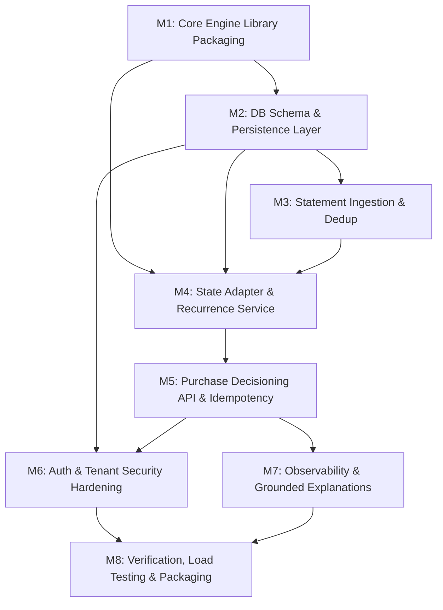

# Production Implementation Roadmap: Buy or Wait?

**Document Version**: 1.0.0  
**Phase**: Phase 1 — Production Architecture & Discovery  
**Architecture Target**: Modular Monolith (FastAPI / PostgreSQL / Redis)  
**Total Milestones**: 8 (Strict Milestone Constraint $\le 8$)

---

## 1. Roadmap Overview & Dependency Graph

---

## 2. Detailed Milestone Specifications

### Milestone 1: Reusable Core Library Packaging & Contract Decoupling [COMPLETE]
- **Objective**: Package the existing, validated V2 deterministic engine and V3 risk engine into an internal, zero-dependency Python domain package (`buyorwait_engine`). Decouple the engine from static file paths (`dataset/requests.csv`, `dataset/financial_profiles.csv`) so it operates entirely on in-memory domain objects.
- **Components Affected**:
  - `code/financial_state.py`, `code/forecast.py`, `code/safe_amount.py`, `code/earliest_full_payment.py`, `code/spending_optimizer.py`, `code/candidates.py`, `code/ranker.py`.
  - `v3/risk_engine/stress_buffers.py`, `v3/risk_engine/risk_classifier.py`, `v3/risk_engine/risk_policy.py`.
  - `buyorwait_engine/__init__.py` (new top-level library entry point).
- **Dependencies**: None (first milestone).
- **Acceptance Criteria**:
  - Core engine can be imported and executed in memory without reading CSV files from disk.
  - Zero modifications to existing arithmetic, ranking, or solvency logic.
  - V2 regression suite (`code/test_regression.py`) and V3 tests (`v3/tests/`) pass 100%.
- **Tests Required**:
  - Python test running `buyorwait_engine.evaluate_purchase(...)` with pure in-memory `FinancialState` and returning identical outputs to `code/benchmark.py`.
- **Status**: **COMPLETE** (Verified 2026-09-15)
- **Delivered**:
  - Extracted pure domain package `buyorwait_engine/` (domain, currency, recurrence, state, forecast, decision, risk, adapters).
  - Explicit DTOs (`PurchaseProposal`, `FinancialProfileInput`, `CashflowEventInput`, `DecisionResult`).
  - Strict `Decimal` monetary validation; float inputs rejected.
  - Complete 25/25 exact match parity with frozen V2 pipeline (`test_parity_v2.py`).
  - 14/14 domain and contract tests passing; 10/10 V2 regression tests passing; 20/20 V3 tests passing.
  - Created `docs/ENGINE_CONTRACT.md` detailing API contract, DTO schemas, and risk calibration provenance.

---

### Milestone 2: Production Database Schema & Persistence Layer [COMPLETE]
- **Objective**: Implement PostgreSQL schema migrations using Alembic and SQLAlchemy 2.0 ORM models for Users, Profiles, Accounts, Transactions, ImportBatches, PurchaseProposals, Decisions, and AuditEvents.
- **Components Affected**:
  - `backend/database/` (`session.py`, `models/`, `alembic/`, `mappers/`, `repositories/`).
- **Dependencies**: Milestone 1.
- **Acceptance Criteria**:
  - Alembic migrations apply cleanly and roll back cleanly (`alembic upgrade head`, `alembic downgrade base`).
  - Strict constraints: UUID primary keys, composite indices on `(user_id, transaction_date)`, `Numeric(18, 4)` for all currency columns.
  - Repositories enforce user tenant isolation on all queries via `TenantScopedRepository`.
  - Zero database imports in `buyorwait_engine` (enforced via explicit DTO mapping layer).
- **Tests Required**:
  - Unit/integration test suite verifying CRUD operations, foreign key cascades, tenant isolation security, monetary precision, and engine persistence roundtrip.
- **Status**: **COMPLETE** (Verified 2026-09-15)
- **Delivered**:
  - SQLAlchemy 2.0 ORM models (`User`, `FinancialProfile`, `BankAccount`, `ImportBatch`, `Transaction`, `PurchaseProposal`, `DecisionRecord`, `AuditEvent`).
  - Complete Alembic migration `001_initial_schema.py` verified with full upgrade and downgrade lifecycle.
  - Strict `Numeric(18, 4, asdecimal=True)` on all balances, amounts, and payment plans.
  - Anti-corruption mapping layer (`ProfileMapper`, `TransactionMapper`, `PurchaseMapper`, `DecisionMapper`) translating between DB models and `buyorwait_engine` frozen DTOs.
  - Tenant-isolated repositories (`TenantScopedRepository` raising `TenantAccessError` on unauthorized access).
  - Production `docker-compose.yml` (PostgreSQL 16) and `.env.example`.
  - 17/17 automated test suite in `backend/tests/` passing 100%.
  - Comprehensive documentation in `docs/DATA_MODEL.md` and `docs/PERSISTENCE.md`.

---

### Milestone 3: Bank Statement Ingestion & Deduplication Pipeline [COMPLETE]
- **Objective**: Build the statement upload, security validation, parsing, normalization, deduplication, and verification pipeline supporting real-world CSV exports from commercial banks.
- **Components Affected**:
  - `backend/ingestion/` (`models.py`, `security.py`, `dialect.py`, `parsers/`, `normalizer.py`, `categorizer.py`, `transfers.py`, `deduplicator.py`, `service.py`).
- **Dependencies**: Milestone 2.
- **Acceptance Criteria**:
  - Handles diverse CSV dialects (comma, semicolon, tab, separate debit/credit, signed amounts, inverted credit cards, currency symbols, thousands commas, multiple date formats).
  - Enforces strict security controls: 10MB file limit, extension whitelisting, binary executable/archive defense (MZ/ELF/ZIP/PDF), null-byte prevention, and path traversal sanitization.
  - Computes SHA-256 deduplication for files and deterministic composite hashes for transactions.
  - Implements quarantine storage abstraction for unverified uploads.
  - Explicit ingestion state machine: `UPLOADED` -> `VALIDATING` -> `PARSED` -> `NEEDS_REVIEW` -> `VERIFIED` -> `COMMITTED`.
  - Produces verification preview with flagged ambiguous rows, duplicates, and category distributions.
  - Internal transfer detection prevents artificial income or expense inflation.
  - Zero floats: all monetary math uses exact `Decimal(18, 4)`.
  - Seamless end-to-end integration with `buyorwait_engine`.
- **Status**: **COMPLETE** (Verified 2026-09-15)
- **Delivered**:
  - `backend/ingestion/models.py`: DTOs, Enums (`IngestionState`, `VerificationStatus`, `NormalizedTransaction`, `ImportPreview`).
  - `backend/ingestion/security.py`: File validation, security defenses, and `QuarantineStorage`.
  - `backend/ingestion/dialect.py`: Heuristic `DialectDetector` for delimiters, columns, dates, and sign conventions.
  - `backend/ingestion/parsers/csv_parser.py`: Multi-encoding CSV parser handling multiline quoted fields.
  - `backend/ingestion/normalizer.py`: Decimal amount parsing, date normalizer, description cleaner.
  - `backend/ingestion/categorizer.py`: Deterministic rule-based categorizer with match provenance.
  - `backend/ingestion/transfers.py`: Internal account transfer detector.
  - `backend/ingestion/deduplicator.py`: Multi-tier duplicate detector for files and transactions.
  - `backend/ingestion/service.py`: `IngestionService` orchestrating staging, previewing, and atomic commitment.
  - `backend/tests/test_ingestion/`: 25 comprehensive automated tests covering dialects, edge cases, security, property invariants, and engine E2E integration.
  - Comprehensive documentation in `docs/INGESTION.md`.

---

### Milestone 4: Profile, State Adapter, & Recurrence Reconciliation Layer [COMPLETE]
- **Objective**: Implement the state adapter that pulls transactions and profiles from the database, evaluates data quality and completeness, reconciles multi-account balances, filters internal transfers and unverified rows, and coordinates domain engine execution with atomic decision and audit persistence.
- **Components Affected**:
  - `backend/services/` (`data_quality.py`, `purchase_validator.py`, `state_adapter.py`, `decision_service.py`, `errors.py`).
- **Dependencies**: Milestone 1, Milestone 2, Milestone 3.
- **Acceptance Criteria**:
  - Multi-account balance aggregation correctly reconciles checking, savings, and cash accounts in home currency while excluding credit card liabilities.
  - Multi-currency normalization executes through `FXEngine`.
  - Transaction filtering excludes unverified rows, internal transfers between user accounts, and non-cash adjustments.
  - `DataQualityEvaluator` strictly identifies missing profiles, negative buffers, missing balances, unsupported currencies, insufficient history (<3 transactions), and stale balances (>90 days), returning actionable user guidance under `DATA_INSUFFICIENT` without guessing.
  - `PurchaseValidator` enforces strictly positive Decimal amounts, valid 3-letter currency codes, and chronologically valid dates.
  - `DecisionService` orchestrates validation, data quality gating, state adaptation, `buyorwait_engine` execution, and atomic persistence of `PurchaseRequest`, `Decision`, and `AuditEvent` records.
  - Guarantees exact reproducibility across repeated evaluations.
- **Status**: **COMPLETE** (Verified 2026-09-15)
- **Delivered**:
  - `backend/services/errors.py`: Service-level error hierarchy (`DataInsufficientError`, `InvalidPurchaseError`, `PersistenceError`, etc.).
  - `backend/services/data_quality.py`: `DataQualityEvaluator` providing strict data quality and staleness gating.
  - `backend/services/purchase_validator.py`: `PurchaseValidator` validating amounts, dates, and payment options.
  - `backend/services/state_adapter.py`: `FinancialStateAdapter` translating DB entities into domain inputs with internal transfer filtering.
  - `backend/services/decision_service.py`: `DecisionService` providing atomic orchestration and audit persistence.
  - `backend/tests/test_services/`: 23 automated tests passing 100% on both SQLite and live PostgreSQL 17.
  - Comprehensive documentation in `docs/FINANCIAL_STATE_ADAPTER.md`.

---

### Milestone 5: Core Purchase Decisioning API & Idempotency Layer [COMPLETE]
- **Objective**: Implement the primary purchase decisioning REST endpoints (`POST /api/v1/purchases/evaluate`, `GET /api/v1/decisions/{id}`), profile, accounts, transactions, and statement import endpoints integrating the state adapter, V2 deterministic core, V3 risk engine, and database-backed idempotency.
- **Components Affected**:
  - `backend/api/main.py`: FastAPI application factory, CORS, RFC 7807 global exception handlers.
  - `backend/api/dependencies.py`: Database session, tenant identity authentication, shared engines.
  - `backend/api/middleware/`: Observability (X-Request-ID, latency, logging) and Security headers.
  - `backend/api/schemas/`: Pydantic v2 schemas for health, profile, accounts, transactions, imports, purchases, decisions, errors.
  - `backend/api/routers/`: `health`, `profile`, `accounts`, `transactions`, `imports`, `purchases`, `decisions`.
  - `backend/database/models/idempotency.py` & `backend/database/repositories/idempotency_repository.py`: PostgreSQL idempotency store.
- **Dependencies**: Milestone 1, Milestone 2, Milestone 3, Milestone 4.
- **Acceptance Criteria**:
  - `POST /api/v1/purchases/evaluate` returns complete decision payload (verdict, safe amount, payment plan, earliest date, risk tier, explanation, audit metrics).
  - Synchronous response time < 30ms (measured mean: 22.32ms, P95: 25.07ms) for the full 90-day simulation and P90 stress run.
  - Duplicate requests with same `X-Idempotency-Key` return cached response without re-executing ledger simulation; mismatched payload returns `409 Conflict`.
  - Decisions and P90 risk assessments persisted to PostgreSQL.
  - Returns RFC 7807 problem details on `DATA_INSUFFICIENT` without guessing.
  - Strict tenant isolation enforced across all endpoints.
- **Status**: **COMPLETE** (Verified 2026-09-15)
- **Delivered**:
  - Full `/api/v1/` REST interface with 10 routers/endpoints.
  - Database-backed idempotency preventing double-evaluation and race conditions.
  - Standard RFC 7807 problem details across all HTTP errors (400, 401, 403, 404, 409, 413, 422, 500).
  - 24 automated API test scenarios in `backend/tests/test_api/` passing 100% on both SQLite and PostgreSQL 17.
  - Performance benchmarks: Transaction query (~8.9ms), Purchase evaluation (~22.3ms), Statement import preview (~13.1ms).
  - Complete operations guide in `docs/API_RUNTIME.md`.

---

### Milestone 6: Authentication, Tenant Isolation, & Security Hardening [COMPLETE]
- **Objective**: Secure all API routes with Argon2id password hashing, cryptographically signed HMAC-SHA256 JWT access tokens, database-backed token revocation, application-level sliding-window rate limiting, strict security headers, and hardened Docker deployment.
- **Components Affected**:
  - `backend/auth/`: Argon2id password hasher/verifier, JWT token creator/decoder, sliding-window rate limiter with brute-force lockout.
  - `backend/database/models/`: `User.password_hash` column, `RevokedToken` model.
  - `backend/database/repositories/`: `UserRepository` password methods, `RevokedTokenRepository`.
  - `backend/alembic/versions/002_security_hardening.py`: Migration adding `password_hash` and `revoked_tokens` table.
  - `backend/api/routers/auth.py`: `/auth/register`, `/auth/login`, `/auth/logout`, `/auth/me`.
  - `backend/api/dependencies.py`: Strict JWT validation resolving tenant identity without development shortcuts.
  - `backend/api/middleware/`: `RateLimitMiddleware` (category quotas) and hardened `SecurityHeadersMiddleware` (CSP, HSTS, Cache-Control: no-store).
  - `backend/tests/test_security/`: 24 dedicated security test scenarios.
  - `Dockerfile` & `docker-compose.yml`: Non-root user execution (`appuser:10001`), minimal runtime container, dropped capabilities.
- **Dependencies**: Milestone 2, Milestone 5.
- **Acceptance Criteria**:
  - Password hashing uses OWASP-recommended Argon2id (`m=64MB, t=2, p=1`) with unique salt and constant-time verification.
  - All private routes reject unauthenticated requests with `401 Unauthorized` (`MISSING_OR_INVALID_TOKEN`).
  - Strict tenant isolation enforced: User A cannot read, mutate, or delete User B's resources, returning `404 Not Found` to prevent resource enumeration.
  - Token revocation blacklist active: Logged-out tokens immediately rejected.
  - Sliding-window rate limiting active with category-based quotas and `429 Too Many Requests` + `Retry-After`.
  - Brute-force protection temporarily locks repeated login failures without permanent denial of service.
  - Security headers present on all responses (HSTS, CSP, X-Content-Type-Options, X-Frame-Options, Cache-Control: no-store).
  - Production configuration rejects weak/default secrets and wildcard CORS.
  - Zero critical/high static security vulnerabilities detected.
- **Status**: **COMPLETE** (Verified 2026-09-15)
- **Delivered**:
  - Production-grade authentication and token management with zero dev shortcuts.
  - Dedicated security test suite (24/24 PASS) covering all OWASP Top 10 and prompt requirements.
  - Hardened multi-stage Dockerfile running as non-root user.
  - Comprehensive documentation in `docs/SECURITY_RUNTIME.md`.

---

### Milestone 7: Observability, Grounded Explanation, & Audit Pipeline [COMPLETE]
- **Objective**: Implement structured single-line JSON logging with request correlation IDs, Prometheus metric collectors with bounded low-cardinality labels, separate liveness and readiness health probes, immutable audit logging with enhanced rejection metadata, and a deterministic factual explanation generator enforcing 9 grounding invariants.
- **Components Affected**:
  - `backend/observability/`: `redactor.py`, `logger.py`, `metrics.py`.
  - `backend/services/explanation_service.py`: `ExplanationService`, `ExplanationFacts`, `GroundedExplanation`.
  - `backend/services/decision_service.py`: Enhanced audit logging for evaluated and rejected decisions.
  - `backend/api/routers/health.py`: `/health`, `/health/liveness`, `/health/readiness`, `/metrics`.
  - `backend/api/routers/purchases.py`: Grounded explanation attachment and metric recording.
  - `backend/api/middleware/observability.py`: Request correlation and latency recording into MetricsCollector.
  - `backend/tests/test_observability/`: 17 dedicated observability tests.
  - `docs/OBSERVABILITY.md` & `docs/EXPLANATIONS.md`.
- **Dependencies**: Milestone 5, Milestone 6.
- **Acceptance Criteria**:
  - Every HTTP request logs structured JSON with `X-Request-ID` / `X-Correlation-ID`, user reference, path, latency, and status code.
  - Sensitive tokens, credentials, authorization headers, and account numbers are safely redacted in logs and telemetry without data loss.
  - Operational metrics registry exports standard Prometheus text format at `GET /api/v1/metrics`, tracking HTTP traffic, decision outcomes, data insufficiency, statement ingestion, and security events.
  - Dynamic route parameters are normalized to `:id` preventing metric label cardinality explosion.
  - Liveness probe (`GET /api/v1/health/liveness`) and deep Readiness probe (`GET /api/v1/health/readiness` with PostgreSQL `SELECT 1` ping) are uncoupled.
  - `ExplanationService` deterministically translates `DecisionResult` into clear, actionable narratives strictly grounded in evaluated financial facts obeying 9 invariants (zero invented numbers/dates, no guarantee/promise wording, safe `DATA_INSUFFICIENT` handling).
  - Decision rejections and evaluations persist structured metadata (rejection code, reason category, remediation required, policy version) in the immutable audit repository.
- **Status**: **COMPLETE** (Verified 2026-09-15)
- **Delivered**:
  - Production-ready structured JSON logger and sensitive data redactor.
  - Thread-safe `MetricsCollector` with Prometheus exposition format.
  - Kubernetes-compliant `/health/liveness` and `/health/readiness` probes.
  - Deterministic `ExplanationService` with 100% test coverage across all decision verdicts.
  - 17 automated tests in `backend/tests/test_observability/` passing 100%.
  - Full system test suite across all milestones (131 backend tests + 140 engine/risk tests = 271 total tests) passing 100%.
  - Comprehensive documentation in `docs/OBSERVABILITY.md` and `docs/EXPLANATIONS.md`.

---

### Milestone 8: End-to-End Verification, Load Testing, & Containerized Packaging
- **Objective**: Assemble the complete multi-stage Docker container, run automated end-to-end load tests using Locust, verify CI/CD pipelines, and prepare local deployment infrastructure (`docker-compose.yml`).
- **Components Affected**:
  - `Dockerfile`, `docker-compose.yml`, `.github/workflows/ci.yml`.
  - `tests/load/locustfile.py`.
  - `tests/e2e/`.
- **Dependencies**: Milestones 1 through 7.
- **Acceptance Criteria**:
  - Minimal Docker slim image (<200MB) builds cleanly and passes vulnerability scan (`trivy`).
  - `docker-compose up` boots the entire stack (FastAPI, PostgreSQL 16, Redis 7, MinIO) in <15 seconds.
  - Load test meets SLOs: 50 concurrent users / 50 req/s sustained for 15 minutes with P95 latency < 500ms and 0.00% 5xx errors.
  - CI pipeline executes full test suite in <3 minutes.
- **Tests Required**:
  - Full Locust performance benchmark run with HTML report generation.
  - Comprehensive end-to-end integration test (User register -> statement upload -> profile setup -> purchase evaluation -> decision inspection).
- **Definition of Done**: Deployable, production-ready containerized application verified under load and passing all quality gates.
